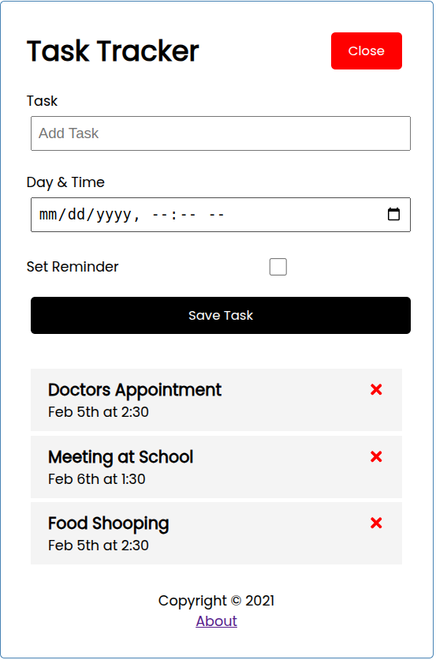

# ✅ Task Tracker (Todo App)

A clean and minimal React-based Task Tracker app to manage your daily to-do list. Add, delete, and mark tasks as completed — all in a smooth UI.

---

## 🚀 Features

- ✍️ Add new tasks  
- 🗑️ Delete tasks  
- ✅ Mark tasks as complete/incomplete  
- 💾 Data persistence with local storage *(optional)*  
- 📱 Responsive design for mobile and desktop

---

## 🛠️ Tech Stack

- ⚛️ React JS (Functional Components + Hooks)  
- 🧠 useState, useEffect for state management  
- 💅 CSS or Tailwind for styling  
- 🗃️ LocalStorage (for saving tasks locally)

---

## 🌈 Getting Started

### 1. Clone the repo

```
git clone https://github.com/your-username/task-tracker.git
cd task-tracker
```

### 2. Install dependencies

```
npm install
```

### 3. Run the app

```bash
npm start
```

Open your browser at: [http://localhost:3000](http://localhost:3000)

---

## 📁 Project Structure

```
task-tracker/
├── public/
├── src/
│   ├── components/
│   │   ├── Header.js
│   │   ├── AddTask.js
│   │   ├── Footer.js
│   │   └── AddTass.js
│   ├── App.js
│   └── index.js
├── .gitignore
└── README.md
```

---

## 📸 Screenshots

<!--  -->


---

## 📌 To-Do

- [ ] Add drag-and-drop functionality  
- [ ] Add edit task feature  
- [ ] Deploy on GitHub Pages / Vercel  

---

## 🧑‍💻 Author

- **Abhishek P Naik**  
- GitHub: [@abhishekpnaik05](https://github.com/abhishekpnaik05)

---

## 📄 License

This project is open-source and available under the [MIT License](LICENSE).
